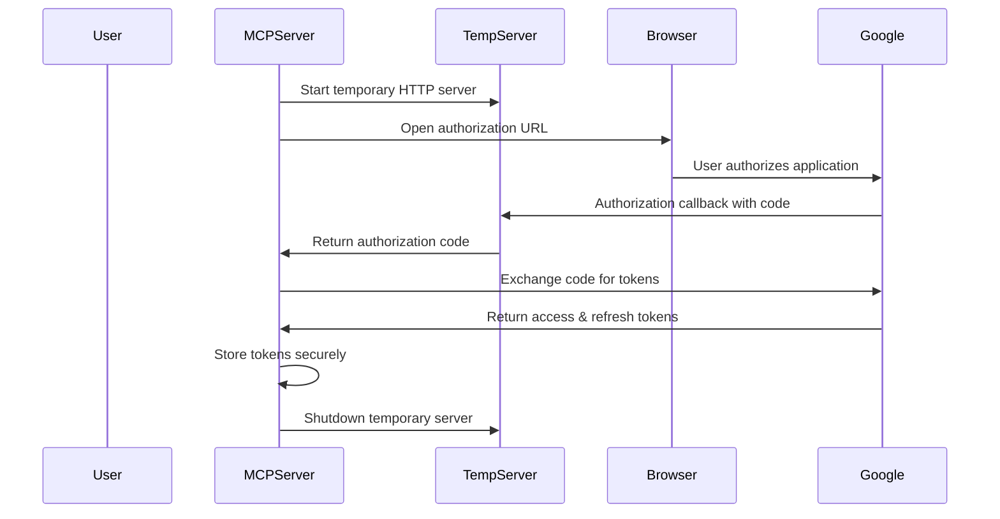

# Phase 3: OAuth Authentication (PLANNED)

## Overview
This phase implements secure Google OAuth 2.0 authentication with token management, enabling the MCP server to access Google APIs on behalf of users while maintaining privacy and security.

## Objectives
1. [ ] Configure Google Cloud OAuth 2.0 credentials and environment
2. [ ] Implement OAuth manager with PKCE flow
3. [ ] Create temporary HTTP server for OAuth callbacks
4. [ ] Implement secure token storage with AES-256-GCM encryption
5. [ ] Add automatic token refresh mechanism
6. [ ] Implement scope validation and management
7. [ ] Create comprehensive authentication tests
8. [ ] Add OAuth integration tests

## Implementation Plan

### Step 1: Google Cloud Setup
**Reference**: `docs/implementation/04-oauth-setup.md`

1. **Google Cloud Project Configuration**
   - Create or select Google Cloud project
   - Enable required Google APIs (Gmail, Drive, Calendar, Docs, Sheets)
   - Configure OAuth consent screen
   - Create OAuth 2.0 Client ID credentials

2. **OAuth Credentials Setup**
   - Application type: Desktop application
   - Authorized redirect URIs: `http://localhost:8080/auth/callback`
   - Download client credentials JSON
   - Configure environment variables

### Step 2: OAuth Flow Implementation
**Reference**: `docs/implementation/05-auth-flow.md`

**Files to Create:**
- `src/auth/oauthManager.ts` - Main OAuth flow coordinator
- `src/auth/authServer.ts` - Temporary HTTP server for callback
- `src/auth/scopeManager.ts` - OAuth scope validation and management

**Key Components:**
```typescript
class OAuthManager {
  async authenticate(scopes: string[]): Promise<TokenInfo> {
    // Start temporary HTTP server
    // Generate authorization URL with PKCE
    // Open browser or provide URL to user
    // Wait for authorization callback
    // Exchange code for tokens
    // Store tokens securely
  }

  async ensureValidToken(scopes: string[]): Promise<string> {
    // Check cached tokens
    // Validate token expiration
    // Refresh if needed
    // Return valid access token
  }
}
```

### Step 3: Token Management
**Reference**: `docs/implementation/06-token-management.md`

**Files to Create:**
- `src/auth/tokenStorage.ts` - Encrypted token storage
- `src/auth/tokenRefresh.ts` - Automatic token refresh
- `src/auth/tokenCache.ts` - In-memory token caching

**Key Features:**
- AES-256-GCM encryption for stored tokens
- Automatic token refresh before expiration
- In-memory caching for performance
- Secure token cleanup on shutdown

## Detailed Implementation

### OAuth Flow Architecture


### Security Implementation

#### Token Encryption
```typescript
class TokenStorage {
  private encryptionKey: Buffer;

  async storeTokens(tokens: TokenInfo): Promise<void> {
    const encrypted = this.encrypt(JSON.stringify(tokens));
    await fs.writeFile(this.tokenPath, encrypted);
  }

  private encrypt(data: string): Buffer {
    const iv = crypto.randomBytes(16);
    const cipher = crypto.createCipher('aes-256-gcm', this.encryptionKey);
    // ... encryption implementation
  }
}
```

#### Scope Management
```typescript
const GOOGLE_SCOPES = {
  GMAIL_READONLY: 'https://www.googleapis.com/auth/gmail.readonly',
  GMAIL_SEND: 'https://www.googleapis.com/auth/gmail.send',
  DRIVE: 'https://www.googleapis.com/auth/drive',
  CALENDAR: 'https://www.googleapis.com/auth/calendar',
  DOCS: 'https://www.googleapis.com/auth/documents',
  SHEETS: 'https://www.googleapis.com/auth/spreadsheets',
} as const;

class ScopeManager {
  validateScopes(requested: string[]): void {
    // Validate against known scopes
    // Check for minimal scope principle
    // Ensure no unnecessary permissions
  }
}
```

## Environment Configuration

### Required Environment Variables
```env
# Google OAuth Configuration
GOOGLE_CLIENT_ID=your_google_client_id_here
GOOGLE_CLIENT_SECRET=your_google_client_secret_here
GOOGLE_REDIRECT_URI=http://localhost:8080/auth/callback

# Token Security
MCP_ENCRYPTION_KEY=your_32_byte_encryption_key_here

# OAuth Settings
OAUTH_CALLBACK_PORT=8080
OAUTH_CALLBACK_TIMEOUT=300000  # 5 minutes
```

### Configuration Schema
```typescript
const AuthConfigSchema = z.object({
  google: z.object({
    clientId: z.string().min(1),
    clientSecret: z.string().min(1),
    redirectUri: z.string().url(),
  }),
  security: z.object({
    encryptionKey: z.string().length(64), // 32 bytes hex
  }),
  oauth: z.object({
    callbackPort: z.number().default(8080),
    callbackTimeout: z.number().default(300000),
  }),
});
```

## Implementation Files

### Authentication Module Structure
```
src/auth/
├── oauthManager.ts           # Main OAuth coordinator
├── authServer.ts             # Temporary HTTP server
├── tokenStorage.ts           # Encrypted token storage
├── tokenRefresh.ts           # Automatic refresh logic
├── tokenCache.ts             # In-memory caching
├── scopeManager.ts           # Scope validation
└── types.ts                  # Authentication types
```

### Integration Points
- **MCP Server**: Integrate auth manager for tool authentication
- **Google API Clients**: Use auth manager for API calls
- **Configuration**: Add auth configuration validation
- **Error Handling**: Add authentication-specific errors

## Testing Strategy

### Unit Tests
```typescript
describe('OAuthManager', () => {
  it('should generate valid authorization URL', () => {
    // Test PKCE code generation
    // Validate URL parameters
    // Check state parameter
  });

  it('should exchange code for tokens', async () => {
    // Mock Google token endpoint
    // Test token exchange
    // Validate token storage
  });

  it('should refresh expired tokens', async () => {
    // Mock expired token scenario
    // Test refresh flow
    // Validate new tokens
  });
});
```

### Integration Tests
```typescript
describe('OAuth Integration', () => {
  it('should complete full OAuth flow', async () => {
    // Start OAuth flow
    // Simulate user authorization
    // Verify token storage
    // Test API call with tokens
  });

  it('should handle OAuth errors gracefully', async () => {
    // Test user denial
    // Test network errors
    // Test invalid credentials
  });
});
```

### Security Tests
- Token encryption/decryption
- Secure token cleanup
- Scope validation
- PKCE implementation
- State parameter validation

## Success Criteria

### Functional Requirements
- [ ] OAuth flow completes successfully with user authorization
- [ ] Tokens are stored securely with encryption
- [ ] Token refresh works automatically
- [ ] Scope validation prevents over-privileged requests
- [ ] Error handling provides clear guidance for auth issues

### Security Requirements
- [ ] Tokens encrypted at rest using AES-256-GCM
- [ ] PKCE implemented for OAuth flow security
- [ ] State parameter prevents CSRF attacks
- [ ] Minimal scope requests (principle of least privilege)
- [ ] Secure cleanup of sensitive data

### Integration Requirements
- [ ] MCP tools can authenticate Google API calls
- [ ] Multiple scopes handled correctly
- [ ] Token refresh transparent to API clients
- [ ] Configuration validation prevents setup errors

## Error Handling

### Authentication Errors
```typescript
class AuthenticationError extends GoogleMCPError {
  constructor(message: string, cause?: Error) {
    super('AUTHENTICATION_FAILED', 'auth', message, false);
    this.cause = cause;
  }
}

class TokenExpiredError extends GoogleMCPError {
  constructor() {
    super('TOKEN_EXPIRED', 'auth', 'Access token has expired', true);
  }
}

class ScopeError extends GoogleMCPError {
  constructor(requested: string[], available: string[]) {
    super('INSUFFICIENT_SCOPE', 'auth', 
      `Requested scopes ${requested} not available in ${available}`, false);
  }
}
```

### Recovery Strategies
- **Token Expiration**: Automatic refresh with fallback to re-authorization
- **Network Errors**: Retry with exponential backoff
- **User Denial**: Clear error message with re-authorization option
- **Invalid Credentials**: Configuration validation and setup guidance

## Performance Considerations

### Token Caching
- In-memory cache for frequently used tokens
- Configurable TTL based on token expiration
- Automatic cache invalidation on refresh

### OAuth Flow Optimization
- Temporary server startup/shutdown optimization
- Browser launch optimization
- Callback handling efficiency

### Security vs Performance
- Balance between security (encryption) and performance (caching)
- Minimize token storage I/O operations
- Efficient scope validation

## Integration with Phase 4

### Google API Client Preparation
- Auth manager interface ready for API clients
- Token management transparent to API calls
- Error handling integrated with API error scenarios
- Scope management supports service-specific requirements

### MCP Tool Authentication
- Tools can request authentication for specific scopes
- Automatic token refresh during tool execution
- Error handling provides user-actionable messages
- Configuration validation prevents runtime auth failures

## Risk Mitigation

### Security Risks
- **Token Storage**: Use proven encryption libraries
- **OAuth Flow**: Follow OAuth 2.0 security best practices
- **Scope Creep**: Implement strict scope validation
- **Credential Exposure**: Secure environment variable handling

### Operational Risks
- **User Experience**: Clear setup instructions and error messages
- **Browser Compatibility**: Test with multiple browsers
- **Network Issues**: Robust error handling and retry logic
- **Configuration Errors**: Comprehensive validation and guidance

This phase establishes secure, reliable authentication that enables all Google API integrations while maintaining user privacy and security. The implementation follows OAuth 2.0 best practices and provides a foundation for the comprehensive Google service integration in Phase 4.
