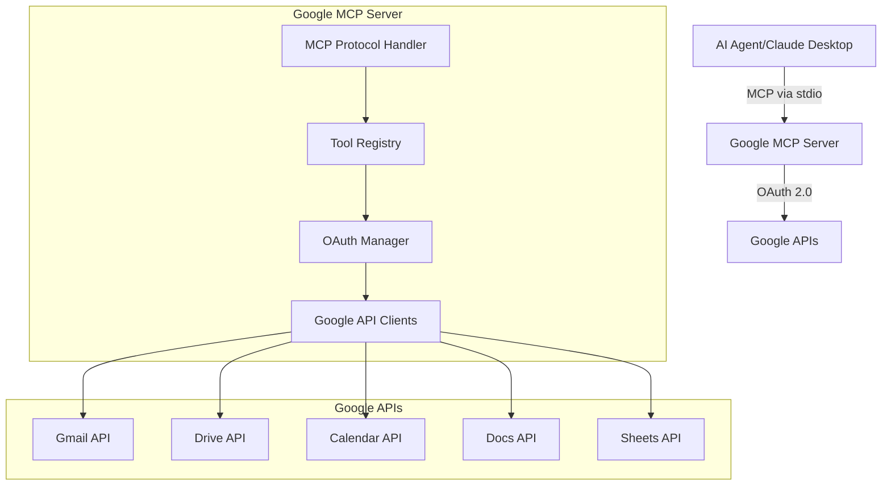
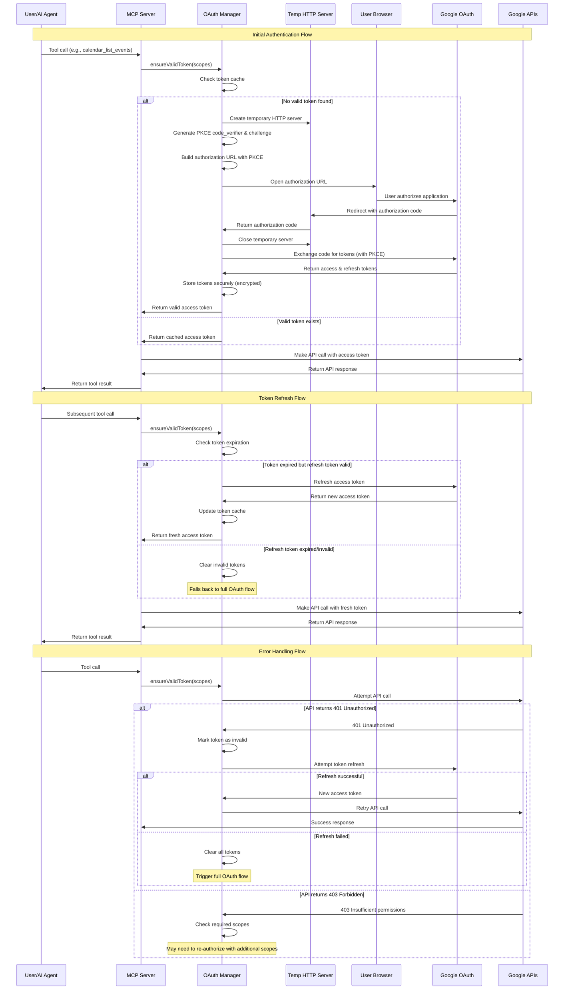
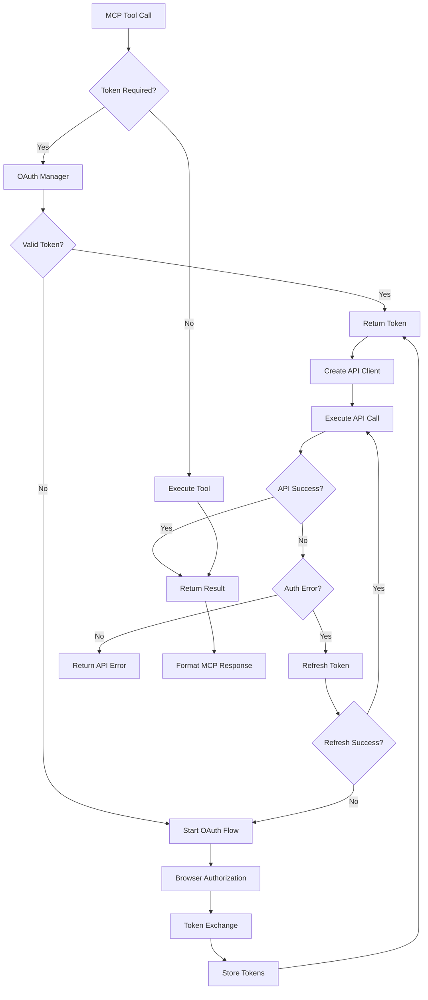

# System Patterns - Architecture and Design

> **Note on Implementation Status**: This document outlines the **proven architecture patterns** from the current implementation. The project has successfully implemented Calendar, Gmail, Drive, and Sheets integrations using these patterns, with 15 MCP tools across 4 Google services. Advanced patterns (e.g., Circuit Breaker, Rate Limiter) are planned for Production Hardening phase. The Service Module Pattern, OAuth Management, Tool Registry, and Screenshot Technology patterns are fully implemented and proven effective.

## Overall Architecture

### High-Level System Design



## OAuth 2.0 + PKCE Authentication Flow

### Complete OAuth Flow Diagram



### OAuth Flow Components

#### 1. PKCE (Proof Key for Code Exchange)
- **Code Verifier**: Cryptographically random string (43-128 characters)
- **Code Challenge**: SHA256 hash of code verifier, base64url encoded
- **Challenge Method**: Always "S256" for security
- **Purpose**: Prevents authorization code interception attacks

#### 2. Temporary HTTP Server
- **Lifecycle**: Created only during OAuth flow, destroyed after
- **Port**: Dynamic port selection (typically 8080-8090 range)
- **Security**: Localhost only, single-use callback handler
- **Timeout**: 5-minute maximum wait for user authorization

#### 3. Token Management
- **Storage**: Encrypted local storage using system keychain
- **Caching**: In-memory cache with scope-based keys
- **Refresh**: Automatic refresh 5 minutes before expiration
- **Cleanup**: Automatic cleanup of expired/invalid tokens

#### 4. Scope Management
- **Dynamic Scopes**: Different tools require different permission scopes
- **Incremental Authorization**: Request additional scopes as needed
- **Scope Validation**: Verify token has required scopes before API calls
- **Minimal Permissions**: Request only necessary scopes per service

### Integration with MCP Tool Execution



### Security Considerations

#### 1. Token Security
- **Encryption**: All stored tokens encrypted with system-specific keys
- **Memory Protection**: Tokens cleared from memory after use
- **Transmission**: HTTPS only for all OAuth communications
- **Rotation**: Automatic token rotation on refresh

#### 2. PKCE Implementation
- **Cryptographic Randomness**: Secure random number generation
- **Challenge Verification**: Server-side verification of PKCE challenge
- **Code Lifetime**: Short-lived authorization codes (10 minutes max)
- **Single Use**: Authorization codes can only be used once

#### 3. Scope Isolation
- **Principle of Least Privilege**: Request minimal required scopes
- **Service Separation**: Different tokens for different Google services
- **User Consent**: Clear scope descriptions during authorization
- **Audit Trail**: Log all scope requests and grants

### Error Recovery Patterns

#### 1. Network Failures
- **Retry Logic**: Exponential backoff for transient failures
- **Circuit Breaker**: Prevent cascading failures
- **Offline Mode**: Graceful degradation when APIs unavailable
- **User Feedback**: Clear error messages for network issues

#### 2. Authentication Failures
- **Token Invalidation**: Automatic cleanup of invalid tokens
- **Re-authorization**: Seamless re-auth flow for expired credentials
- **Scope Expansion**: Handle insufficient permission errors
- **User Guidance**: Clear instructions for authentication issues

#### 3. API Limitations
- **Rate Limiting**: Respect Google API quotas and limits
- **Quota Management**: Track and manage API usage
- **Fallback Strategies**: Alternative approaches when APIs unavailable
- **User Communication**: Inform users of temporary limitations

### Core Architectural Principles

#### 1. Stdio-Based MCP Communication
- **No HTTP Server**: Communication via stdin/stdout using MCP protocol
- **JSON-RPC**: Standard JSON-RPC 2.0 message format
- **Bidirectional**: Support for both tool calls and resource access
- **Error Handling**: Comprehensive error responses with proper MCP formatting

#### 2. Modular Service Architecture
- **Service Isolation**: Each Google service (Gmail, Drive, etc.) as independent module
- **Consistent Interface**: All services implement common patterns
- **Tool Registration**: Dynamic tool discovery and registration
- **Lazy Loading**: Services initialized only when needed

#### 3. Type-Safe Implementation
- **Strict TypeScript**: Full type safety with strict mode enabled
- **Interface Contracts**: Well-defined interfaces for all components
- **Runtime Validation**: Zod schemas for configuration and input validation
- **Compile-Time Safety**: Prevent errors through strong typing

## TypeScript Design Patterns

### 1. Service Interface Pattern

```typescript
// Base interface for all Google services
interface GoogleService<TConfig = any> {
  readonly name: string;
  readonly requiredScopes: string[];
  
  initialize(auth: AuthManager, config: TConfig): Promise<void>;
  getTools(): MCPTool[];
  validateToken(): Promise<boolean>;
  cleanup(): Promise<void>;
}

// Concrete implementation
class CalendarService implements GoogleService<CalendarConfig> {
  readonly name = 'calendar';
  readonly requiredScopes = ['https://www.googleapis.com/auth/calendar'];
  
  async initialize(auth: AuthManager, config: CalendarConfig): Promise<void> {
    // Implementation
  }
  
  getTools(): MCPTool[] {
    return [
      this.createListEventsTools(),
      this.createCreateEventTool(),
      // ... other tools
    ];
  }
}
```

### 2. Tool Factory Pattern

```typescript
// Tool creation with type safety
interface ToolDefinition<TInput, TOutput> {
  name: string;
  description: string;
  inputSchema: JSONSchema7;
  handler: (input: TInput) => Promise<TOutput>;
}

function createMCPTool<TInput, TOutput>(
  definition: ToolDefinition<TInput, TOutput>
): MCPTool {
  return {
    name: definition.name,
    description: definition.description,
    inputSchema: definition.inputSchema,
    handler: async (args: unknown) => {
      // Runtime validation
      const validatedInput = validateInput<TInput>(args, definition.inputSchema);
      const result = await definition.handler(validatedInput);
      return formatMCPResponse(result);
    }
  };
}
```

### 3. Error Handling Pattern

```typescript
// Discriminated union for error handling
type ServiceResult<T> = 
  | { success: true; data: T }
  | { success: false; error: ServiceError };

class ServiceError extends Error {
  constructor(
    public readonly code: string,
    public readonly service: string,
    message: string,
    public readonly retryable: boolean = false
  ) {
    super(message);
  }
}

// Usage in service methods
async function listEvents(): Promise<ServiceResult<CalendarEvent[]>> {
  try {
    const events = await this.calendarClient.events.list();
    return { success: true, data: events };
  } catch (error) {
    return { 
      success: false, 
      error: new ServiceError('LIST_EVENTS_FAILED', 'calendar', error.message)
    };
  }
}
```

### 4. Configuration Pattern

```typescript
// Zod schemas for runtime validation
const ServerConfigSchema = z.object({
  auth: z.object({
    clientId: z.string(),
    clientSecret: z.string(),
    redirectUri: z.string().url(),
  }),
  features: z.object({
    calendar: z.boolean().default(true),
    gmail: z.boolean().default(true),
    drive: z.boolean().default(true),
  }),
  logging: z.object({
    level: z.enum(['DEBUG', 'INFO', 'WARN', 'ERROR']).default('INFO'),
  }),
});

type ServerConfig = z.infer<typeof ServerConfigSchema>;

// Configuration loading with validation
function loadConfig(): ServerConfig {
  const rawConfig = {
    auth: {
      clientId: process.env.GOOGLE_CLIENT_ID,
      clientSecret: process.env.GOOGLE_CLIENT_SECRET,
      redirectUri: process.env.GOOGLE_REDIRECT_URI,
    },
    // ... other config
  };
  
  return ServerConfigSchema.parse(rawConfig);
}
```

## MCP Protocol Patterns

### 1. Tool Registration Pattern

```typescript
class ToolRegistry {
  private tools = new Map<string, MCPTool>();
  
  register(service: GoogleService): void {
    const serviceTools = service.getTools();
    for (const tool of serviceTools) {
      if (this.tools.has(tool.name)) {
        throw new Error(`Tool ${tool.name} already registered`);
      }
      this.tools.set(tool.name, tool);
    }
  }
  
  async executeTool(name: string, args: unknown): Promise<MCPToolResult> {
    const tool = this.tools.get(name);
    if (!tool) {
      throw new Error(`Tool ${name} not found`);
    }
    
    return await tool.handler(args);
  }
  
  listTools(): MCPToolInfo[] {
    return Array.from(this.tools.values()).map(tool => ({
      name: tool.name,
      description: tool.description,
      inputSchema: tool.inputSchema,
    }));
  }
}
```

### 2. Message Handling Pattern

```typescript
class MCPMessageHandler {
  constructor(
    private toolRegistry: ToolRegistry,
    private resourceRegistry: ResourceRegistry
  ) {}
  
  async handleMessage(message: MCPMessage): Promise<MCPResponse> {
    try {
      switch (message.method) {
        case 'tools/list':
          return this.handleListTools();
        
        case 'tools/call':
          return this.handleToolCall(message.params);
        
        case 'resources/list':
          return this.handleListResources();
        
        default:
          throw new Error(`Unknown method: ${message.method}`);
      }
    } catch (error) {
      return this.createErrorResponse(message.id, error);
    }
  }
  
  private async handleToolCall(params: ToolCallParams): Promise<MCPResponse> {
    const result = await this.toolRegistry.executeTool(
      params.name, 
      params.arguments
    );
    
    return {
      jsonrpc: '2.0',
      id: params.id,
      result: result,
    };
  }
}
```

## Google API Integration Patterns

### 1. API Client Wrapper Pattern

```typescript
abstract class GoogleAPIClient<TClient> {
  protected client: TClient | null = null;
  
  constructor(
    protected auth: AuthManager,
    protected config: any
  ) {}
  
  protected async getClient(): Promise<TClient> {
    if (!this.client) {
      await this.auth.ensureValidToken(this.requiredScopes);
      this.client = await this.createClient();
    }
    return this.client;
  }
  
  protected abstract get requiredScopes(): string[];
  protected abstract createClient(): Promise<TClient>;
  
  async withRetry<T>(operation: () => Promise<T>): Promise<T> {
    const maxRetries = 3;
    let lastError: Error;
    
    for (let attempt = 1; attempt <= maxRetries; attempt++) {
      try {
        return await operation();
      } catch (error) {
        lastError = error;
        
        if (this.isRetryableError(error) && attempt < maxRetries) {
          await this.delay(Math.pow(2, attempt) * 1000);
          continue;
        }
        
        throw error;
      }
    }
    
    throw lastError!;
  }
  
  private isRetryableError(error: any): boolean {
    return error.code === 429 || // Rate limited
           error.code >= 500;     // Server errors
  }
}
```

### 2. OAuth Management Pattern

```typescript
class AuthManager {
  private tokenCache = new Map<string, TokenInfo>();
  
  async ensureValidToken(scopes: string[]): Promise<string> {
    const scopeKey = scopes.sort().join(',');
    const cached = this.tokenCache.get(scopeKey);
    
    if (cached && !this.isTokenExpired(cached)) {
      return cached.accessToken;
    }
    
    const token = await this.refreshOrReauthorize(scopes);
    this.tokenCache.set(scopeKey, token);
    return token.accessToken;
  }
  
  private async refreshOrReauthorize(scopes: string[]): Promise<TokenInfo> {
    try {
      return await this.refreshToken(scopes);
    } catch (error) {
      // If refresh fails, start new OAuth flow
      return await this.startOAuthFlow(scopes);
    }
  }
  
  private async startOAuthFlow(scopes: string[]): Promise<TokenInfo> {
    // Personal use: Single user OAuth flow
    const server = await this.createTemporaryServer();
    const authUrl = this.generateAuthUrl(scopes, server.port);
    
    // Open browser for personal authorization
    await this.openBrowser(authUrl);
    
    // Wait for personal authorization callback
    const authCode = await server.waitForCallback();
    server.close();
    
    // Exchange code for personal account tokens
    return await this.exchangeCodeForTokens(authCode);
  }
}
```

## Error Handling and Resilience Patterns

### 1. Circuit Breaker Pattern

```typescript
class CircuitBreaker {
  private failures = 0;
  private lastFailureTime = 0;
  private state: 'CLOSED' | 'OPEN' | 'HALF_OPEN' = 'CLOSED';
  
  constructor(
    private threshold: number = 5,
    private timeout: number = 60000
  ) {}
  
  async execute<T>(operation: () => Promise<T>): Promise<T> {
    if (this.state === 'OPEN') {
      if (Date.now() - this.lastFailureTime > this.timeout) {
        this.state = 'HALF_OPEN';
      } else {
        throw new Error('Circuit breaker is OPEN');
      }
    }
    
    try {
      const result = await operation();
      this.onSuccess();
      return result;
    } catch (error) {
      this.onFailure();
      throw error;
    }
  }
  
  private onSuccess(): void {
    this.failures = 0;
    this.state = 'CLOSED';
  }
  
  private onFailure(): void {
    this.failures++;
    this.lastFailureTime = Date.now();
    
    if (this.failures >= this.threshold) {
      this.state = 'OPEN';
    }
  }
}
```

### 2. Rate Limiting Pattern

```typescript
class RateLimiter {
  private requests: number[] = [];
  
  constructor(
    private maxRequests: number,
    private windowMs: number
  ) {}
  
  async acquire(): Promise<void> {
    const now = Date.now();
    
    // Remove old requests outside the window
    this.requests = this.requests.filter(time => now - time < this.windowMs);
    
    if (this.requests.length >= this.maxRequests) {
      const oldestRequest = Math.min(...this.requests);
      const waitTime = this.windowMs - (now - oldestRequest);
      await this.delay(waitTime);
      return this.acquire(); // Retry after waiting
    }
    
    this.requests.push(now);
  }
  
  private delay(ms: number): Promise<void> {
    return new Promise(resolve => setTimeout(resolve, ms));
  }
}
```

## Testing Patterns

### 1. Service Testing Pattern

```typescript
describe('CalendarService', () => {
  let service: CalendarService;
  let mockAuth: jest.Mocked<AuthManager>;
  let mockClient: jest.Mocked<calendar_v3.Calendar>;
  
  beforeEach(() => {
    mockAuth = createMockAuthManager();
    mockClient = createMockCalendarClient();
    service = new CalendarService();
  });
  
  it('should list events successfully', async () => {
    // Arrange
    const mockEvents = [createMockEvent()];
    mockClient.events.list.mockResolvedValue({ data: { items: mockEvents } });
    
    // Act
    const result = await service.listEvents({ maxResults: 10 });
    
    // Assert
    expect(result.success).toBe(true);
    if (result.success) {
      expect(result.data).toEqual(mockEvents);
    }
  });
  
  it('should handle API errors gracefully', async () => {
    // Arrange
    mockClient.events.list.mockRejectedValue(new Error('API Error'));
    
    // Act
    const result = await service.listEvents({ maxResults: 10 });
    
    // Assert
    expect(result.success).toBe(false);
    if (!result.success) {
      expect(result.error.code).toBe('LIST_EVENTS_FAILED');
    }
  });
});
```

### 2. MCP Integration Testing Pattern

```typescript
describe('MCP Integration', () => {
  let server: GoogleMCPServer;
  let client: MCPTestClient;
  
  beforeEach(async () => {
    server = new GoogleMCPServer();
    client = new MCPTestClient();
    await server.start();
    await client.connect(server);
  });
  
  afterEach(async () => {
    await client.disconnect();
    await server.stop();
  });
  
  it('should list available tools', async () => {
    const response = await client.listTools();
    
    expect(response.tools).toContainEqual(
      expect.objectContaining({
        name: 'calendar_list_events',
        description: expect.any(String),
      })
    );
  });
  
  it('should execute calendar tool successfully', async () => {
    const response = await client.callTool('calendar_list_events', {
      maxResults: 5
    });
    
    expect(response.content).toBeDefined();
    expect(response.isError).toBeFalsy();
  });
});
```

## Configuration and Environment Patterns

### 1. Environment-Based Configuration

```typescript
// Environment variable mapping with defaults
const ENV_CONFIG = {
  GOOGLE_CLIENT_ID: { required: true },
  GOOGLE_CLIENT_SECRET: { required: true },
  GOOGLE_REDIRECT_URI: { default: 'http://localhost:8080/auth/callback' },
  MCP_LOG_LEVEL: { default: 'INFO' },
  NODE_ENV: { default: 'development' },
} as const;

function loadEnvironmentConfig(): Partial<ServerConfig> {
  const config: any = {};
  
  for (const [key, options] of Object.entries(ENV_CONFIG)) {
    const value = process.env[key];
    
    if (!value && options.required) {
      throw new Error(`Required environment variable ${key} is not set`);
    }
    
    config[key] = value || options.default;
  }
  
  return config;
}
```

### 2. Feature Flag Pattern

```typescript
class FeatureManager {
  private features: Map<string, boolean>;
  
  constructor(config: FeatureConfig) {
    this.features = new Map([
      ['calendar', config.calendar ?? true],
      ['gmail', config.gmail ?? true],
      ['drive', config.drive ?? true],
      ['docs', config.docs ?? false],
      ['sheets', config.sheets ?? false],
    ]);
  }
  
  isEnabled(feature: string): boolean {
    return this.features.get(feature) ?? false;
  }
  
  getEnabledServices(): string[] {
    return Array.from(this.features.entries())
      .filter(([_, enabled]) => enabled)
      .map(([feature, _]) => feature);
  }
}
```

These patterns provide a solid foundation for building a maintainable, type-safe, and robust Google MCP Server. Each pattern addresses specific concerns while maintaining consistency across the codebase.
