# Technical Context - Technologies and Development Setup

## Core Technology Stack

### Runtime Environment
- **Node.js**: Version 18+ required for modern JavaScript features and MCP SDK compatibility
- **TypeScript**: Version 5.8+ with strict mode for compile-time safety and enhanced developer experience
- **NPM**: Package management with package-lock.json for reproducible builds

### Primary Dependencies

#### MCP Protocol
- **@modelcontextprotocol/sdk**: Version 1.13.3+ for MCP protocol implementation
  - Provides stdio transport for communication with MCP clients
  - JSON-RPC 2.0 message handling
  - Tool and resource registration capabilities
  - Type definitions for MCP protocol

#### Google APIs
- **googleapis**: Version 150.0.1+ for Google API client libraries
  - Unified client for all Google services (Gmail, Drive, Calendar, Docs, Sheets)
  - Built-in retry logic and error handling
  - TypeScript definitions included

- **google-auth-library**: Version 10.1.0+ for OAuth 2.0 authentication
  - OAuth 2.0 flow implementation with PKCE support
  - Token management and refresh capabilities
  - Secure credential handling

#### Document Processing
- **pdf-parse**: Version 1.1.1+ for PDF text extraction
  - Extracts text content from PDF files
  - Handles various PDF formats and encodings
  - Used in Drive file processing and Gmail attachments

- **mammoth**: Version 1.6.0+ for DOCX content extraction
  - Converts DOCX files to HTML/text
  - Preserves document structure and formatting
  - Used in Drive file processing and Gmail attachments

#### Validation and Configuration
- **zod**: Version 3.25.71+ for runtime schema validation
  - Type-safe configuration validation
  - Input parameter validation for MCP tools
  - Environment variable validation

- **dotenv**: Version 17.0.1+ for environment variable management
  - Development configuration loading
  - Secure credential management

### Development Dependencies

#### TypeScript Tooling
- **typescript**: Version 5.8+ compiler with ES2022 target
- **@types/node**: Node.js type definitions for TypeScript
- **ts-node**: TypeScript execution for development
- **nodemon**: Hot reloading during development

#### Code Quality
- **eslint**: Version 9.30.1+ for code linting
- **@typescript-eslint/parser**: TypeScript parser for ESLint
- **@typescript-eslint/eslint-plugin**: TypeScript-specific linting rules

#### Testing Framework
- **jest**: Version 30.0+ for unit and integration testing
- **ts-jest**: TypeScript preprocessor for Jest
- **@types/jest**: TypeScript definitions for Jest

## Development Environment Setup

### Prerequisites
```bash
# Node.js 18+ (recommended: use nvm for version management)
node --version  # Should be 18.0.0 or higher
npm --version   # Should be 8.0.0 or higher

# Git for version control
git --version
```

### Project Initialization
```bash
# Clone and setup
git clone <repository-url>
cd mcp-google
npm install

# Environment configuration
cp .env.example .env
# Edit .env with your configuration
```

### Development Scripts
```json
{
  "scripts": {
    "build": "tsc",                    // Compile TypeScript to JavaScript
    "build:watch": "tsc --watch",      // Watch mode compilation
    "dev": "nodemon --exec ts-node src/index.ts",  // Development server
    "start": "node dist/index.js",     // Production server
    "type-check": "tsc --noEmit",      // Type checking without compilation
    "lint": "eslint src/**/*.ts",      // Code linting
    "lint:fix": "eslint src/**/*.ts --fix",  // Auto-fix linting issues
    "test": "jest",                    // Run tests
    "test:watch": "jest --watch",      // Watch mode testing
    "clean": "rm -rf dist"             // Clean build artifacts
  }
}
```

## TypeScript Configuration

### Compiler Options
```json
{
  "compilerOptions": {
    "target": "ES2022",                    // Modern JavaScript features
    "module": "ESNext",                    // ES modules
    "moduleResolution": "node",            // Node.js module resolution
    "outDir": "./dist",                    // Compiled output directory
    "rootDir": "./src",                    // Source code directory
    "strict": true,                        // Enable all strict type checking
    "esModuleInterop": true,              // CommonJS/ES module interop
    "skipLibCheck": true,                  // Skip type checking of declaration files
    "forceConsistentCasingInFileNames": true,  // Enforce consistent file naming
    "declaration": true,                   // Generate .d.ts files
    "declarationMap": true,               // Generate declaration source maps
    "sourceMap": true,                    // Generate source maps for debugging
    "removeComments": false,              // Keep comments in output
    "noImplicitAny": true,               // Error on implicit any types
    "noImplicitReturns": true,           // Error on missing return statements
    "noImplicitThis": true,              // Error on implicit this types
    "noUnusedLocals": true,              // Error on unused local variables
    "noUnusedParameters": true,          // Error on unused parameters
    "exactOptionalPropertyTypes": true,   // Strict optional property handling
    "resolveJsonModule": true             // Allow importing JSON files
  }
}
```

### Key TypeScript Features Used
- **Strict Mode**: Full type safety with all strict checks enabled
- **Discriminated Unions**: Type-safe error handling patterns
- **Generic Types**: Reusable components with type parameters
- **Interface Inheritance**: Clean abstraction hierarchies
- **Conditional Types**: Advanced type manipulation
- **Template Literal Types**: Type-safe string manipulation

## Google API Integration

### Required Google Cloud Setup
1. **Google Cloud Project**: Create or select existing project
2. **API Enablement**: Enable required Google APIs
   - Gmail API: `gmail.googleapis.com`
   - Drive API: `drive.googleapis.com`
   - Calendar API: `calendar-json.googleapis.com`
   - Docs API: `docs.googleapis.com`
   - Sheets API: `sheets.googleapis.com`

3. **OAuth 2.0 Credentials**: Create OAuth 2.0 Client ID
   - Application type: Desktop application
   - Authorized redirect URIs: `http://localhost:8080/auth/callback`

### OAuth Scopes
```typescript
const GOOGLE_SCOPES = {
  // Calendar API scopes
  CALENDAR: 'https://www.googleapis.com/auth/calendar',
  
  // Gmail API scopes  
  GMAIL_READONLY: 'https://www.googleapis.com/auth/gmail.readonly',
  GMAIL_SEND: 'https://www.googleapis.com/auth/gmail.send',
  GMAIL_LABELS: 'https://www.googleapis.com/auth/gmail.labels',
  
  // Drive API scopes
  DRIVE: 'https://www.googleapis.com/auth/drive',
  DRIVE_FILE: 'https://www.googleapis.com/auth/drive.file',
  
  // Docs API scopes (planned)
  DOCS: 'https://www.googleapis.com/auth/documents',
  
  // Sheets API scopes (planned)
  SHEETS: 'https://www.googleapis.com/auth/spreadsheets',
} as const;
```

### Currently Implemented Services

#### Calendar API Integration ✅
- **Scopes**: `calendar` (read/write access to calendars)
- **Tools**: 2 tools implemented
  - `calendar_list_events`: List calendar events with filtering
  - `calendar_create_event`: Create events with attendees and reminders
- **Features**: Timezone support, reminder configuration, attendee management

#### Gmail API Integration ✅  
- **Scopes**: `gmail.readonly`, `gmail.send`, `gmail.labels`
- **Tools**: 4 tools implemented
  - `gmail_list_messages`: List emails with filtering
  - `gmail_get_message`: Read email content and metadata
  - `gmail_search_messages`: Advanced Gmail query syntax
  - `gmail_download_attachment`: Secure PDF/DOCX only downloads
- **Features**: Email content parsing, attachment handling, security policies

#### Drive API Integration ✅
- **Scopes**: `drive` (full access to Drive files)
- **Tools**: 4 tools implemented
  - `drive_list_files`: List files and folders with metadata
  - `drive_get_file`: Get file content with PDF/DOCX parsing
  - `drive_upload_file`: Upload files with metadata and sharing
  - `drive_create_folder`: Create organized folder structures
- **Features**: Document processing, metadata extraction, file sharing

### API Rate Limits
- **Gmail API**: 1 billion quota units per day, 250 quota units per user per second
- **Drive API**: 1,000 requests per 100 seconds per user
- **Calendar API**: 1,000,000 requests per day
- **Docs API**: 300 requests per minute per project
- **Sheets API**: 300 requests per minute per project

## MCP Protocol Implementation

### Communication Architecture
```typescript
// Stdio-based communication
process.stdin  -> MCP Server -> Google APIs
process.stdout <- MCP Server <- Google APIs
```

### Message Flow
1. **Client Request**: MCP client sends JSON-RPC message via stdin
2. **Server Processing**: MCP server parses message and routes to appropriate handler
3. **API Call**: Server makes authenticated call to Google API
4. **Response**: Server formats response and sends via stdout

### Tool Registration Pattern
```typescript
interface MCPTool {
  name: string;                    // Tool identifier (e.g., "calendar_list_events")
  description: string;             // Human-readable description
  inputSchema: JSONSchema7;        // JSON Schema for input validation
  handler: (args: unknown) => Promise<MCPToolResult>;  // Implementation
}
```

## Error Handling Strategy

### Error Types
```typescript
// Base error class for all Google MCP Server errors
class GoogleMCPError extends Error {
  constructor(
    public readonly code: string,
    public readonly service: string,
    message: string,
    public readonly retryable: boolean = false
  ) {
    super(message);
  }
}

// Specific error types
class AuthenticationError extends GoogleMCPError { /* ... */ }
class AuthorizationError extends GoogleMCPError { /* ... */ }
class ValidationError extends GoogleMCPError { /* ... */ }
class RateLimitError extends GoogleMCPError { /* ... */ }
```

### Retry Logic
- **Exponential Backoff**: 2^attempt * 1000ms delay
- **Maximum Retries**: 3 attempts for retryable errors
- **Retryable Conditions**: HTTP 429 (rate limit), HTTP 5xx (server errors)
- **Circuit Breaker**: Prevent cascading failures

## Configuration Management

### Environment Variables
```env
# Required - Google OAuth Configuration
GOOGLE_CLIENT_ID=your_google_client_id_here
GOOGLE_CLIENT_SECRET=your_google_client_secret_here
GOOGLE_REDIRECT_URI=http://localhost:8080/auth/callback

# Optional - Server Configuration
NODE_ENV=development
MCP_LOG_LEVEL=INFO

# Optional - Feature Flags (Current Implementation Status)
FEATURE_CALENDAR=true    # ✅ Implemented
FEATURE_GMAIL=true       # ✅ Implemented  
FEATURE_DRIVE=true       # ✅ Implemented
FEATURE_DOCS=false       # 🔄 Partially implemented
FEATURE_SHEETS=false     # 📋 Planned

# Optional - Performance Tuning
MCP_CACHE_ENABLED=true
MCP_RATE_LIMIT_REQUESTS=100
MCP_RATE_LIMIT_WINDOW_MS=60000
```

### Document Processing Configuration
```env
# Document processing settings
MAX_FILE_SIZE_MB=50              # Maximum file size for processing
ALLOWED_FILE_TYPES=pdf,docx      # Security policy: PDF and DOCX only
WORKER_TIMEOUT_MS=30000          # Timeout for document processing
ENABLE_CONTENT_EXTRACTION=true   # Enable PDF/DOCX content extraction
```

### Configuration Validation
```typescript
const ConfigSchema = z.object({
  auth: z.object({
    clientId: z.string().min(1),
    clientSecret: z.string().min(1),
    redirectUri: z.string().url(),
  }),
  server: z.object({
    logLevel: z.enum(['DEBUG', 'INFO', 'WARN', 'ERROR']).default('INFO'),
    nodeEnv: z.enum(['development', 'production']).default('development'),
  }),
  features: z.object({
    calendar: z.boolean().default(true),
    gmail: z.boolean().default(true),
    drive: z.boolean().default(true),
    docs: z.boolean().default(false),
    sheets: z.boolean().default(false),
  }),
});
```

## Testing Infrastructure

### Test Categories
1. **Unit Tests**: Individual component testing
2. **Integration Tests**: MCP protocol compliance testing
3. **API Tests**: Google API integration testing (with mocks)
4. **End-to-End Tests**: Full workflow testing

### Jest Configuration
```javascript
module.exports = {
  preset: 'ts-jest',
  testEnvironment: 'node',
  roots: ['<rootDir>/src', '<rootDir>/tests'],
  testMatch: ['**/__tests__/**/*.ts', '**/?(*.)+(spec|test).ts'],
  transform: {
    '^.+\\.ts$': 'ts-jest',
  },
  collectCoverageFrom: [
    'src/**/*.ts',
    '!src/**/*.d.ts',
    '!src/**/*.test.ts',
  ],
  coverageDirectory: 'coverage',
  coverageReporters: ['text', 'lcov', 'html'],
  coverageThreshold: {
    global: {
      branches: 80,
      functions: 80,
      lines: 80,
      statements: 80,
    },
  },
};
```

### Mock Strategies
- **Google API Mocks**: Jest mocks for googleapis library
- **MCP Client Mocks**: Test MCP protocol communication
- **OAuth Mocks**: Mock authentication flows for testing

## Performance Considerations

### Optimization Strategies
1. **Token Caching**: In-memory token storage to reduce auth overhead
2. **API Response Caching**: Cache frequently accessed data
3. **Batch Operations**: Group multiple API calls when possible
4. **Lazy Loading**: Initialize services only when needed
5. **Connection Pooling**: Reuse HTTP connections for API calls

### Monitoring Metrics
- **Response Times**: Track API call latency
- **Error Rates**: Monitor failure rates by service
- **Token Refresh**: Track authentication overhead
- **Memory Usage**: Monitor for memory leaks
- **Rate Limit Usage**: Track API quota consumption

## Security Considerations

### Token Security
- **Encrypted Storage**: AES-256-GCM encryption for stored tokens
- **Memory Protection**: Clear sensitive data from memory after use
- **Scope Minimization**: Request only necessary OAuth scopes
- **Token Rotation**: Automatic refresh token rotation

### Data Protection
- **No Persistent Storage**: No user data stored permanently
- **Local Processing**: All data processing happens locally
- **Secure Transmission**: HTTPS for all API communications
- **Input Validation**: Comprehensive input sanitization

### Document Processing Security
- **File Type Restrictions**: PDF and DOCX only (security policy)
- **Content Sanitization**: Safe text extraction without executable content
- **Size Limits**: Maximum file size limits to prevent resource exhaustion
- **Worker Isolation**: Document processing in isolated workers
- **Timeout Protection**: Processing timeouts prevent hanging operations

## Deployment Considerations

### Local Development
```bash
# Development mode with hot reloading
npm run dev

# Type checking
npm run type-check

# Testing
npm run test:watch
```

### Production Build
```bash
# Clean build
npm run clean
npm run build

# Production start
npm run start
```

### MCP Client Integration
```json
// Claude Desktop configuration
{
  "mcpServers": {
    "google-mcp-server": {
      "command": "node",
      "args": ["/path/to/mcp-google/dist/index.js"],
      "env": {
        "GOOGLE_CLIENT_ID": "your_client_id",
        "GOOGLE_CLIENT_SECRET": "your_client_secret"
      }
    }
  }
}
```

## Current Implementation Status

### Implemented Tools (10 total)

#### Calendar Tools (2)
- `calendar_list_events`: List calendar events with filtering and timezone support
- `calendar_create_event`: Create events with attendees, reminders, timezone handling

#### Gmail Tools (4)  
- `gmail_list_messages`: List emails with filtering (date, sender, labels)
- `gmail_get_message`: Read email content with thread support
- `gmail_search_messages`: Advanced Gmail query syntax support
- `gmail_download_attachment`: Secure PDF/DOCX only attachment downloads

#### Drive Tools (4)
- `drive_list_files`: List files and folders with metadata
- `drive_get_file`: Get file content with PDF/DOCX parsing
- `drive_upload_file`: Upload files with metadata and sharing options
- `drive_create_folder`: Create organized folder structures

### Document Processing Implementation

#### PDF Processing
```typescript
// PDF text extraction using pdf-parse
import pdfParse from 'pdf-parse';

async function extractPdfText(buffer: Buffer): Promise<string> {
  const data = await pdfParse(buffer);
  return data.text;
}
```

#### DOCX Processing  
```typescript
// DOCX content extraction using mammoth
import mammoth from 'mammoth';

async function extractDocxContent(buffer: Buffer): Promise<string> {
  const result = await mammoth.extractRawText({ buffer });
  return result.value;
}
```

#### Security Policy Implementation
```typescript
// File type validation for security
const ALLOWED_FILE_TYPES = ['pdf', 'docx'] as const;

function validateFileType(mimeType: string): boolean {
  const allowedMimeTypes = [
    'application/pdf',
    'application/vnd.openxmlformats-officedocument.wordprocessingml.document'
  ];
  return allowedMimeTypes.includes(mimeType);
}
```

## MCP Server Startup Process

### Claude Desktop ↔ MCP Server Communication Flow

The following diagram illustrates the complete startup process between Claude Desktop and the Google MCP Server, including all internal setup calls and initialization sequences:

```mermaid
sequenceDiagram
    participant CD as Claude Desktop
    participant Process as Node.js Process
    participant Server as GoogleMCPServer
    participant Registry as ToolRegistry
    participant OAuth as OAuthManager
    participant Calendar as CalendarClient
    participant Gmail as GmailClient
    participant Google as Google APIs

    Note over CD,Google: === MCP Server Startup Sequence ===
    
    CD->>Process: Launch MCP server via stdio
    Note over Process: node dist/index.js
    
    Process->>Process: Load environment variables (.env)
    Process->>Server: new GoogleMCPServer()
    
    Note over Server,Google: === Server Initialization ===
    
    Server->>Server: Initialize MCP Server instance
    Note over Server: name: 'google-mcp-server'<br/>version: '1.0.0'<br/>capabilities: tools, resources, prompts
    
    Server->>Server: Initialize StdioServerTransport
    Server->>Server: setupHandlers()
    Note over Server: Register MCP protocol handlers:<br/>- tools/list<br/>- tools/call<br/>- resources/list<br/>- prompts/list
    
    Server->>Registry: Initialize ToolRegistry
    Server->>Server: registerTools()
    
    Note over Server,Google: === Tool Registration Phase ===
    
    Server->>Registry: register(calendarListEventsTool)
    Registry->>Registry: Store tool: 'calendar_list_events'
    
    Server->>Registry: register(calendarCreateEventTool)
    Registry->>Registry: Store tool: 'calendar_create_event'
    
    Server->>Registry: register(gmailListMessagesTool)
    Registry->>Registry: Store tool: 'gmail_list_messages'
    
    Server->>Registry: register(gmailGetMessageTool)
    Registry->>Registry: Store tool: 'gmail_get_message'
    
    Server->>Registry: register(gmailSearchMessagesTool)
    Registry->>Registry: Store tool: 'gmail_search_messages'
    
    Server->>Registry: register(gmailDownloadAttachmentTool)
    Registry->>Registry: Store tool: 'gmail_download_attachment'
    
    Note over Server,Google: === OAuth Manager Initialization ===
    
    Server->>OAuth: Initialize OAuthManager singleton
    OAuth->>OAuth: loadConfig() from environment
    OAuth->>OAuth: new OAuth2Client(clientId, clientSecret, redirectUri)
    OAuth->>OAuth: Set token storage path (.tokens/calendar-tokens.json)
    
    Note over Server,Google: === Server Startup ===
    
    Server->>Server: start()
    Server->>Server: Connect to StdioServerTransport
    Server->>Server: setupGracefulShutdown()
    
    Server->>CD: Ready signal via stdio
    Note over Server: Server listening on stdio<br/>Ready to accept MCP requests
    
    Note over CD,Google: === First Tool Call (Authentication Flow) ===
    
    CD->>Server: MCP Request: tools/list
    Server->>Registry: listTools()
    Registry-->>Server: Available tools list
    Server-->>CD: MCP Response: tools array
    
    CD->>Server: MCP Request: tools/call (calendar_list_events)
    Server->>OAuth: isAuthenticated()
    OAuth->>OAuth: loadTokens() from file system
    
    alt No valid tokens found
        OAuth-->>Server: false (not authenticated)
        Server->>OAuth: authenticate()
        
        Note over OAuth,Google: === OAuth 2.0 + PKCE Flow ===
        
        OAuth->>OAuth: generatePKCE() (code_verifier, code_challenge, state)
        OAuth->>OAuth: findAvailablePort() (8080-8090 range)
        OAuth->>OAuth: startCallbackServer() on available port
        OAuth->>OAuth: generateAuthUrl() with PKCE parameters
        OAuth->>OAuth: openBrowser() with auth URL
        
        Note over OAuth: User completes authentication in browser
        
        Google->>OAuth: OAuth callback with authorization code
        OAuth->>OAuth: validateState() parameter
        OAuth->>Google: exchangeCodeForTokens() with PKCE verifier
        Google-->>OAuth: Access token + Refresh token
        OAuth->>OAuth: storeTokens() with encryption
        OAuth->>OAuth: stopCallbackServer()
        OAuth-->>Server: Authentication complete
        
    else Valid tokens exist
        OAuth->>OAuth: Check token expiry (5-minute buffer)
        
        alt Token needs refresh
            OAuth->>Google: refreshAccessToken()
            Google-->>OAuth: New access token
            OAuth->>OAuth: storeTokens() updated tokens
        end
        
        OAuth-->>Server: Access token
    end
    
    Note over Server,Google: === API Client Initialization ===
    
    Server->>Calendar: Initialize CalendarClient (lazy)
    Calendar->>OAuth: getOAuth2Client()
    OAuth-->>Calendar: Configured OAuth2Client
    Calendar->>Google: Create Calendar API client
    
    Server->>Calendar: Execute calendar_list_events
    Calendar->>Google: calendar.events.list()
    Google-->>Calendar: Events data
    Calendar-->>Server: Formatted MCP response
    Server-->>CD: MCP Response: calendar events
    
    Note over CD,Google: === Subsequent Tool Calls ===
    
    CD->>Server: MCP Request: tools/call (gmail_list_messages)
    Server->>OAuth: ensureValidToken(['gmail.readonly'])
    
    alt Gmail scope not in current token
        OAuth->>OAuth: validateTokenScopes()
        OAuth-->>Server: Scope validation failed
        Server->>OAuth: requestAdditionalScopes(['gmail.readonly'])
        OAuth->>OAuth: forceReauthentication()
        Note over OAuth: Triggers new OAuth flow with additional scopes
    else Gmail scope available
        OAuth-->>Server: Valid access token
    end
    
    Server->>Gmail: Initialize GmailClient (lazy)
    Gmail->>OAuth: getOAuth2Client()
    OAuth-->>Gmail: Configured OAuth2Client
    Gmail->>Google: Create Gmail API client
    
    Server->>Gmail: Execute gmail_list_messages
    Gmail->>Google: gmail.users.messages.list()
    Google-->>Gmail: Messages data
    Gmail-->>Server: Formatted MCP response
    Server-->>CD: MCP Response: gmail messages
    
    Note over CD,Google: === Error Handling Flow ===
    
    CD->>Server: MCP Request: tools/call (invalid_tool)
    Server->>Registry: executeTool('invalid_tool')
    Registry-->>Server: Tool not found error
    Server-->>CD: MCP Error Response
    
    CD->>Server: MCP Request: tools/call (calendar_list_events)
    Server->>Calendar: Execute tool
    Calendar->>Google: API call with expired token
    Google-->>Calendar: 401 Unauthorized
    Calendar->>OAuth: handleInsufficientScopeError()
    OAuth->>OAuth: refreshTokens()
    
    alt Refresh successful
        OAuth-->>Calendar: New access token
        Calendar->>Google: Retry API call
        Google-->>Calendar: Success response
        Calendar-->>Server: Formatted response
        Server-->>CD: MCP Response: success
    else Refresh failed
        OAuth->>OAuth: clearTokens()
        OAuth-->>Server: Authentication required
        Server-->>CD: MCP Error: Authentication required
    end
```



### Key Startup Components

#### 1. **Process Initialization**
- Node.js process starts with `node dist/index.js`
- Environment variables loaded from `.env` file
- Main entry point (`src/index.ts`) executed

#### 2. **MCP Server Setup**
- `GoogleMCPServer` instance created with capabilities
- `StdioServerTransport` initialized for stdio communication
- MCP protocol handlers registered for tools, resources, and prompts

#### 3. **Tool Registration**
- All available tools registered with `ToolRegistry`
- Calendar tools: `calendar_list_events`, `calendar_create_event`
- Gmail tools: `gmail_list_messages`, `gmail_get_message`, `gmail_search_messages`, `gmail_download_attachment`

#### 4. **OAuth Manager Initialization**
- Singleton `OAuthManager` instance created
- Google OAuth2 client configured with credentials
- Token storage path set (`.tokens/calendar-tokens.json`)

#### 5. **Authentication Flow**
- **First Tool Call**: Triggers authentication check
- **OAuth 2.0 + PKCE**: Secure authentication with Google
- **Token Management**: Automatic refresh and scope validation
- **Scope Handling**: Dynamic scope requests for different services

#### 6. **API Client Initialization**
- **Lazy Loading**: Clients created only when needed
- **Calendar Client**: Initialized on first calendar tool call
- **Gmail Client**: Initialized on first Gmail tool call
- **Token Injection**: OAuth tokens automatically provided to clients

#### 7. **Error Handling**
- **Authentication Errors**: Automatic token refresh or re-authentication
- **Scope Errors**: Dynamic scope expansion and re-authentication
- **API Errors**: Retry logic with exponential backoff
- **MCP Errors**: Proper error formatting for MCP protocol

### Startup Performance Characteristics

- **Cold Start**: ~2-3 seconds (includes tool registration and OAuth setup)
- **Warm Start**: ~500ms (with valid cached tokens)
- **Authentication**: ~10-30 seconds (user interaction required)
- **Tool Execution**: ~200-500ms (depending on Google API response time)

## Development Workflow

### Code Quality Checks
```bash
# Before committing
npm run lint          # Check code style
npm run type-check    # Verify TypeScript types
npm run test          # Run test suite
npm run build         # Ensure clean compilation
```

### Debugging
- **VS Code Integration**: Full TypeScript debugging support
- **Source Maps**: Debug compiled JavaScript with TypeScript sources
- **Logging**: Structured logging with configurable levels
- **Error Stack Traces**: Detailed error information with source locations

This technical context provides the foundation for understanding and working with the Google MCP Server codebase, ensuring consistent development practices and reliable operation.
